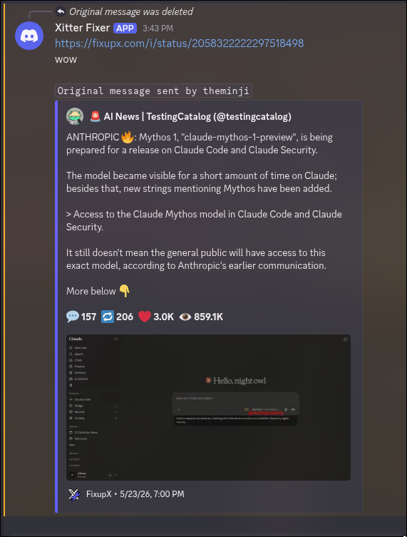

# X link fixer Discord bot

Fixes embeds in Discord, since  normal x.com embeds aren't proper.

The bot simply replies to your message that contains an x.com link with whatever X mirror you choose (default is fixupx.com) so that it embeds (and preserves all text in the original message), and then removes your message with the bad link.

This is useful for AI or other news servers where X posts are shared frequently, especially with images and videos so they render full resolution and nativley in Discord.

## How to use

Step 0: Clone this repo

After that, go to the Discord developer portal: [here](https://discord.com/developers/applications) (https://discord.com/developers/applications) and make a "New Application"

Then go through the setup process, and reset the bot token and save it somewhere (in the `.env.example`, and then rename it to `.env`)

Next, add the bot to your server with `Read Messages` intenet, and `Manage Messages`  and `Send Messages` permission (so it can delete the bad url)

Then feel free to customize `system_settings.py` to your liking (there are instructions in there), and also make a new venv with `python3 -m venv .venv` (or just `python` on Windows)

Install the python packages (just `discord.py` and `python-dotenv`) by running `pip install -r requirements.txt`

And finally, run `python bot.py` and it should work out of the box!

If you use this, please give the repo a star so that other people can see it as well!
